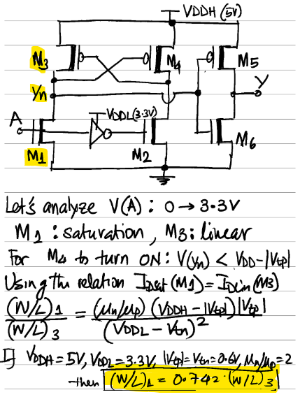
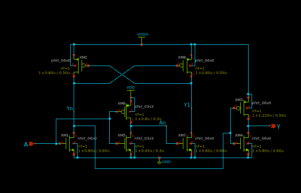
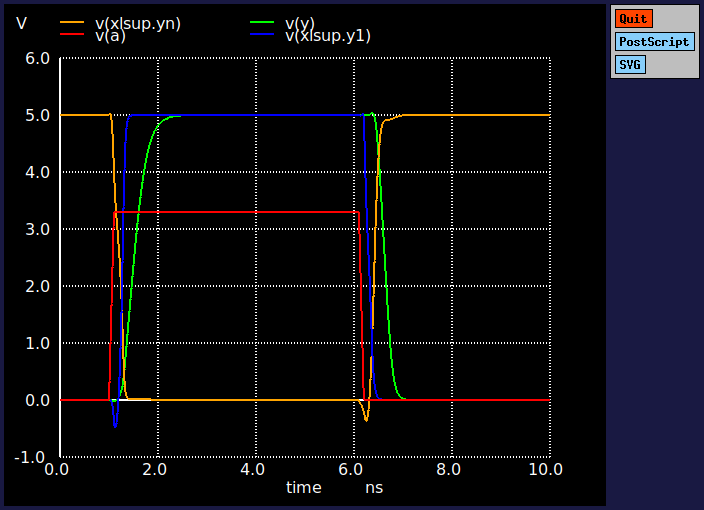

# Level-Shifter Up (3.3V to 5V)

Designer: Saroj Rout

## Description

The **function** of this block is to pass a digital signal from a **low-voltage** (3.3V) domain to a **high-voltage** (5V) domain. This ceel will typically sit on the periphery of the IP do translate signals from one voltage domain to another. 

The **architecture** of the block is a classic _latch-type_ level shifter where, the _low-voltage input_ is provided to a _pseudo-differential_ input pair and the output current of that pair is fed to a _PMOS-latch_. 

Since this is a latch, the **analyis** is done to make sure the latch can be flipped when the input is flipped (`0->1` or `1->0`).

As shown in the _figure_, we will analyze for the condition input (`A`) switching from `0 -> 3.3V`. At the moment when the input is switched, **M1: saturation**, **M3: linear** and we need $V_{GS}(M_4) > |V_{tp}|$. Based on typical values, $(W/L)_1 = 0.742 (W/L)_3$ . With some margin we will design with all **equal transistor sizes**. 

## Design and Simulation

**DESIGN FILES**

- [Schematic](./gf180mcu_osu_sc_gp9t3v3_lshifup.sch)
- [Netlist](./gf180mcu_osu_sc_gp9t3v3_lshifup.spice)
- [Testbench](../../../../tb_digital/tb_lshifup_9t/tb_gf180mcu_osu_sc_gp9t3v3_lshifup.spice)

**SCHEMATIC**

**SIMULATION RESULTS**

**DELAY AND POWER CHARACTERIZATION LEVEL SHIFTER UP**

| Metric | Cl=5f | Cl=10f | Cl=50f |
|--------|-------|--------|--------|
| **trise** (10-90%)| 0.15n | 0.24n | 1n |
| **tfall** (90-10%) | 0.12n | 0.17n | 0.58n |
| **tdel-rise** (50-50%) | 0.21n | 0.25n | 0.62n |
| **tdel-fall** (50-50%) | 0.32n | 0.36n | 0.61n |
| **Ivddh**(avg) | 10uA | 13.2uA | 33uA |

**NOTE** 1) Input slew-rate is 100 ps 2) Average current is claculated over a 10 ns period.

**DELAY AND POWER CHARACTERIZATION INV_1X (5V)**

| Metric | Cl=5f | Cl=10f | Cl=50f |
|--------|-------|--------|--------|
| **trise** (10-90%)| 0.12n | 0.22n | 1n |
| **tfall** (90-10%) | 0.07n | 0.12n | 0.56n |
| **tdel-rise** (50-50%) | 5n | 5n | 5.6n |
| **tdel-fall** (50-50%) | -5n | -5n | -4.7n |
| **Ivddh**(avg) | 3.46uA | 6uA | 25uA |

